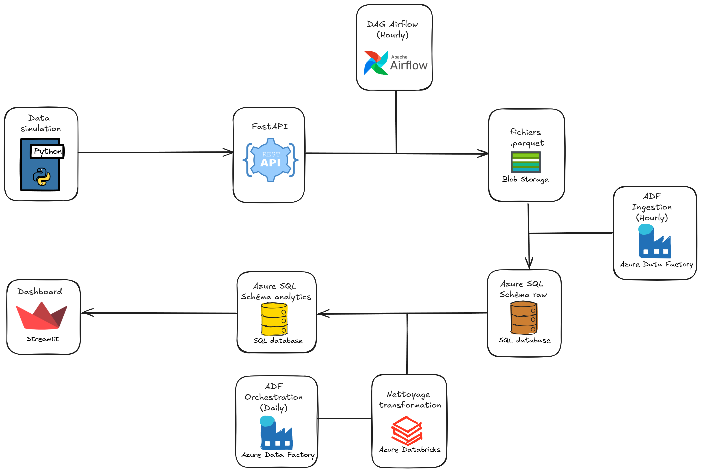
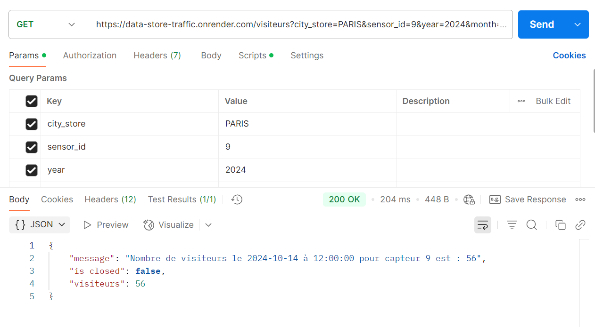
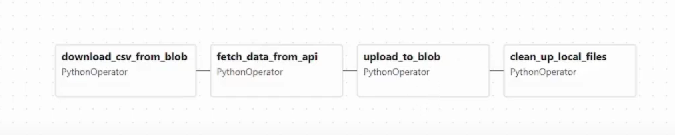
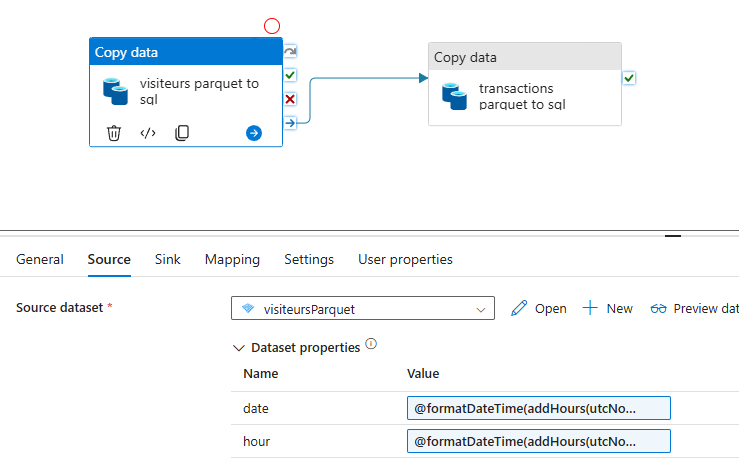
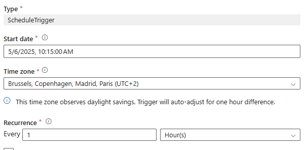
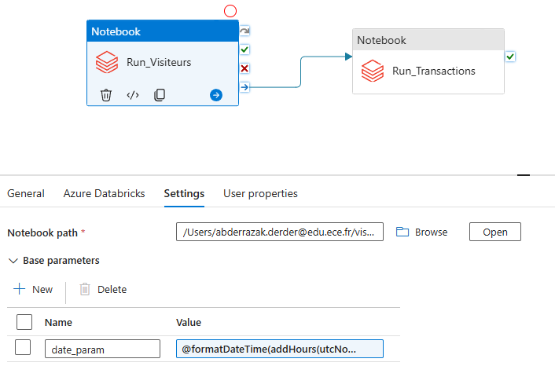
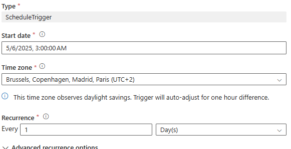
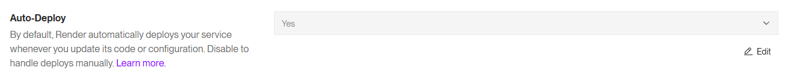

# DataMag360 — Pipeline de Données Cloud Moderne

**DataMag360** est un projet de data engineering simulant une chaîne de traitement de données moderne et automatisée. Il vise à démontrer la valeur d’une architecture cloud scalable de bout en bout.

## 🎯 Objectifs

- Générer des données de fréquentation et de transactions en magasin
- Exposer les données via une API REST (FastAPI)
- Automatiser la collecte horaire avec Apache Airflow
- Stocker les données dans Azure Blob Storage au format Parquet
- Ingestion et transformation via Azure Data Factory et Databricks
- Visualisation interactive via un tableau de bord Streamlit

## ❓ Pourquoi ce projet ?

De nombreuses entreprises disposent encore d'infrastructures obsolètes, avec peu ou pas d'automatisation, ce qui limite l'exploitation efficace des données. **DataMag360** propose une alternative moderne, basée sur des outils cloud robustes : Azure, Databricks, Airflow, Streamlit.

## 🧱 Architecture Globale

Le pipeline couvre l’ensemble du cycle de vie des données : génération → ingestion → transformation → visualisation.

---

## ⚙️ Étapes du pipeline

### 1. Génération des données

- Scripts Python (`sensor.py`, `realistic_sensor.py`) simulant le trafic en magasin
- Exposition via une API FastAPI avec deux endpoints principaux : `/visiteurs` et `/transactions`

### 2. Orchestration API & stockage — Airflow + Blob

- Exécution horaire d’un DAG Apache Airflow
- Appel de l’API FastAPI pour récupérer les données simulées
- Sauvegarde des résultats au format `.parquet` dans Azure Blob Storage

### 3. Ingestion vers SQL — Azure Data Factory (ADF)

- Pipeline ADF déclenché chaque heure
- Copie des fichiers `.parquet` depuis Blob vers Azure SQL Database (`raw schema`)
- Utilisation de paramètres dynamiques (`date`, `hour`) pour lire les bons fichiers

  

### 4. Transformation — Azure Databricks

- Pipeline ADF quotidien déclenchant deux notebooks Databricks
- Nettoyage et traitement des données :
  - Suppression des valeurs nulles
  - Filtrage des valeurs aberrantes (ex. : trop faibles ou trop élevées, générées volontairement)
  - Remplacement par la **moyenne journalière** pour lisser les données dans le dashboard
- Résultats sauvegardés dans le `schema analytics` d’Azure SQL

  

⏱ Pourquoi un déclenchement à 3h du matin ?  
> Pour réduire les coûts Databricks (cluster inactif en journée) et traiter les données de la veille sans conflit.

---

## 📊 Dashboard Streamlit

- Filtres dynamiques : date, capteur, magasin, heure
- Visualisations claires des KPIs : trafic, chiffre d’affaires, taux de conversion

---

## ⚙️ CI / CD

### CI – Intégration Continue

- Formatage du code avec **Black**
- Tests automatiques avec **unittest**
- Pipeline GitHub Actions sur branches `dev` et `main`

### CD – Déploiement Continu

- **FastAPI** automatiquement redéployée sur Render à chaque push

- **Streamlit App** hébergée sur Streamlit Cloud, mise à jour automatiquement

---

## 🧰 Technologies utilisées

| Catégorie          | Stack                                                   |
|--------------------|----------------------------------------------------------|
| Simulation         | Python, FastAPI                                          |
| Orchestration      | Apache Airflow, Azure Data Factory                       |
| Stockage           | Azure Blob Storage, Azure SQL                            |
| Traitement         | PySpark, SQL, Azure Databricks                           |
| Visualisation      | Streamlit                                                |
| CI/CD              | GitHub Actions, Render                                   |

---

## ⚠️ Spécificités techniques

- Conversion de fuseau horaire avec `addHours(utcNow(), 2)` pour se caler sur Paris
- `timestamp_insertion` ≠ `date` pour éviter les erreurs liées à des valeurs corrompues ou manquantes
- Traitements **PySpark SQL** pour optimiser la scalabilité
- Déploiement **automatisé** via Render + Streamlit Cloud

---

## ✅ Conclusion

**DataMag360** est une solution complète et modulaire qui illustre la puissance du cloud pour le traitement de la donnée.  
Du capteur jusqu’au dashboard, chaque étape est automatisée, scalable et adaptée à une mise en production réelle.
